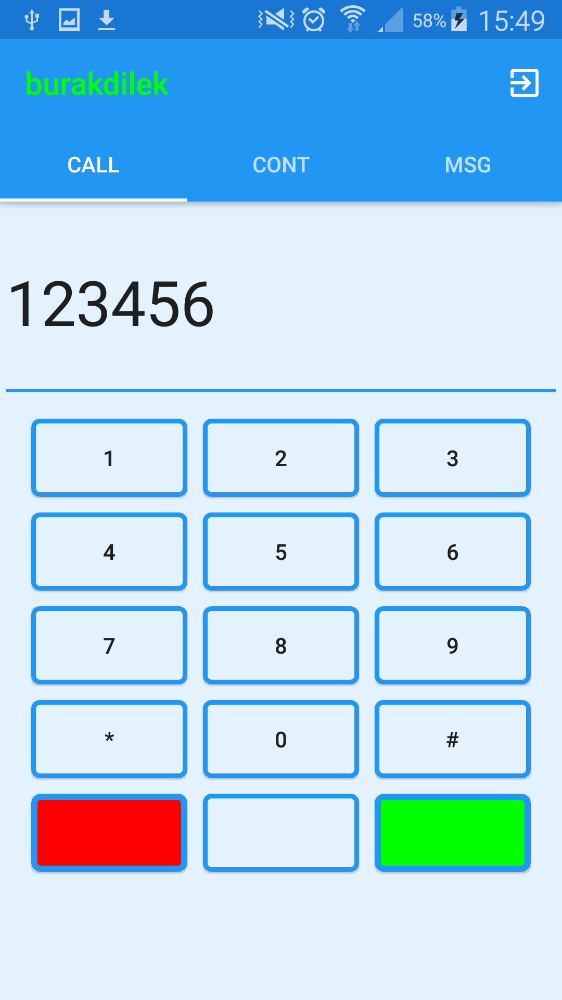
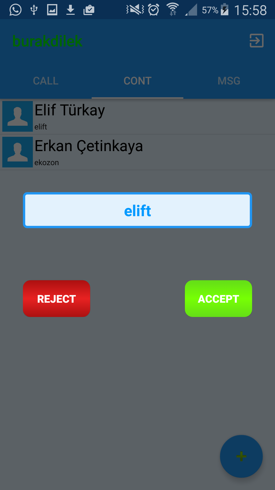
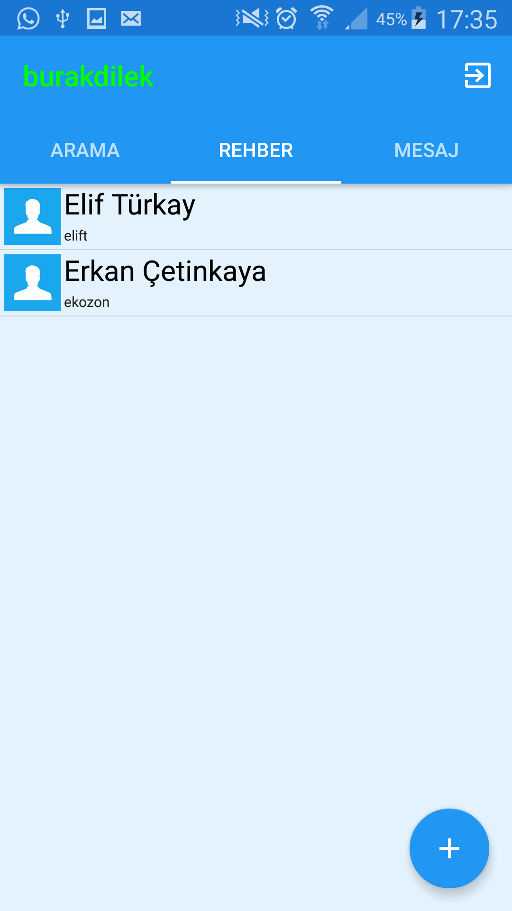
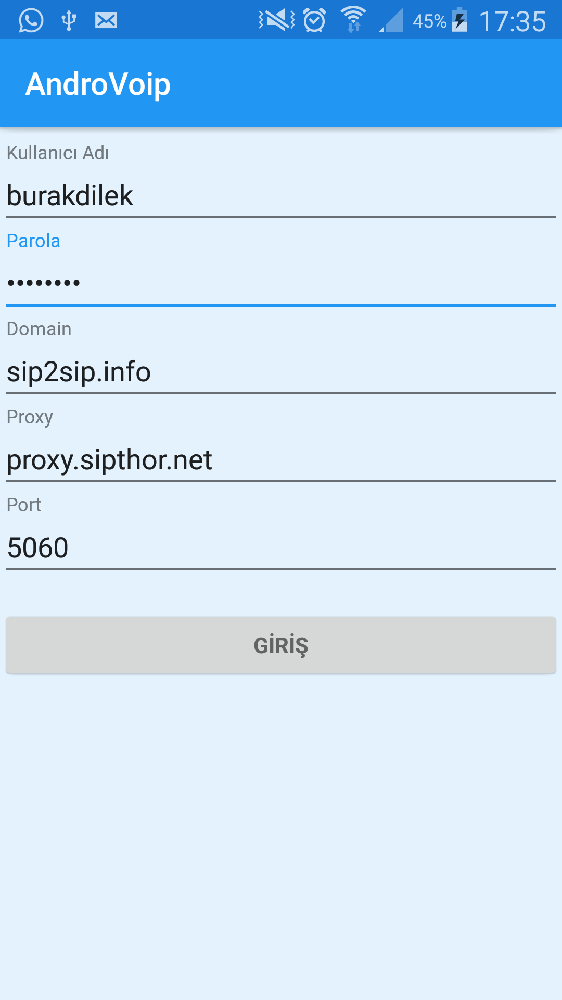

# AndroVoip
This is the Simple Softphone aplication based on android-ngn-stack library.

**Project Owners:** <br>
Hamdi Burak Dilek <br>
Erkan Çetinkaya<br>
Elif Türkay <br>

**Features:**

- **Calling (Sip server)**
	- Speaker(On/Off)
	- Mic(Mute/Not)
- **Message (XMPP Server)**
<br>
-  **Contacts (Local SQLite)**
	- Message Shortcut
	- Call Shortcut
	- View Profile
	- Add Contact
	- Update Contact
	- Delete Contact
=======
This is the Simple Softphone application based on android-ngn-stack library.

###   Projenin Amacı

Bu proje VOIP teknolojisini kullanarak Muğla Üniversitesi içerisindeki öğrencilerin birbiriyle ücretsiz konuşmalarını amaçlayan kurumsal bir projedir.

###   Başlangıç

Projeyi forklayıp cloneladıktan sonra Android Studio içerisine import edebilirsiniz. Başlamadan önce lütfen https://github.com/DoubangoTelecom/imsdroid/ adresindeki dökümentasyonu inceleyiniz.

Test etmek için  adresinden bir profil oluşturunuz.

```sh
https://mdns.sipthor.net/register_sip_account.phtml
```

TODO: Mesajlaşma için XmPP server url'si gir.

```sh
127.0.0.1:8000
```

Not: Aynı kullanıcı ismiyle hesap oluşturmak zorunludur.

###   Activity Akısları

```flow
st=>start: Start
e=>end
op=>operation: Login Ekranı
op1=>operation: Main Activity Arama Rehber Mesaj
op2=>operation: Login Ekrans

st->op->op1
```

```flow
st=>start: Arama
e=>end
op=>condition: Arıyor Ekranı
op1=>operation: Görüşme Başlar

st->op
op(yes)->st
op(yes)->op1
```

```flow
st=>start: Rehber
e=>end
op=>operation: Kişi Ekle (Kişi Adı & Kullanıcı Adı)
op1=>operation: Kişiyi Ara 
Kişiye Mesaj At 
Kişiyi Düzenle 
Kişiyi Sil 

st->op->op1
```

###   Proje İçeriği

Bu proje sip2sip.info adresinin sağladığı Asterisk Server üzerinden konuşmayı gerçekleştiriyor.

Profil bilgilerinizi bir Obje içerisinde toplayıp Register etmek için server'a gönderiyor. Server'dan success cevabıyla birlikte sipSession initialize olmuş oluyor. Artık başka bir Sip adresinden gelen aramaları karşılayabilir durumda olmuş olacaksınız.

###  Yapılacaklar

> sip2sip.info ile bağımsız çalışabilmek için bir Server oluşturmak ve Muğla Üniversitelerindeki her öğrenci için bir sip adresi profili oluşturmak.

>Xmpp Server ile mesajlaşma bağımlılıklarından kurtulmak için bir Xmpp Server oluşturmak ve sip profilleri ile uyumlu profiller oluşturmak.

>Rehber oluşturmak

>GPRS ile konum bilgileri alınma.


### Uygulama Arayüzü







> **Project Owners:**
> - Hamdi Burak Dilek ---> https://github.com/hamdiburakdilek
> - Erkan Çetinkaya ---> https://github.com/erkanderon
> - Elif Türkay ---> https://github.com/cengelif
